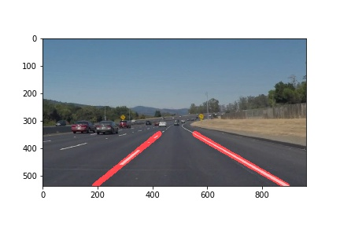

# **Finding Lane Lines on the Road** 

**Finding Lane Lines on the Road**

The goals / steps of this project are the following:
* Make a pipeline that finds lane lines on the road
* Reflect on the results


[//]: # (Image References)

[image1]: ./examples/grayscale.jpg "Grayscale"

---

### Reflection

### 1. Pipeline Description
** 1.1 Existing Helper Code Modifications **

While most of the code to complete the task was added in subsequent sections, a couple of minor tweaks were made to the existing code blocks in the Python notebook. First came the addition of an "*image_name*" variable to quickly load and store the annoted sample images:

```python
#reading in an image
image_name='solidWhiteRight'
image = mpimg.imread('test_images/{}.jpg'.format(image_name))
```

Additionally, *hough_lines()* was modified to return only the lines themselves:

```python
def hough_lines(img, rho, theta, threshold, min_line_len, max_line_gap):
    """
    `img` should be the output of a Canny transform.
    Returns hough lines.
    """
    lines = cv2.HoughLinesP(img, rho, theta, threshold, np.array([]), minLineLength=min_line_len, maxLineGap=max_line_gap)
    return lines
```
** 1.2 Parameter Selection **

Up until line extrapolation, the pipeline relied mostly on the helper functions and previous code examples. The region of interest was trapezoidal, with the following dimensions:

```python 
###################################
# Parameter Definitions:
###################################
# image dimensions
img_width = image.shape[1] # bottom right
img_height = image.shape[0] # bottom y (floor)
roi_y = 350 # ceiling
roi_x1 = 50 # bottom left
roi_x2 = 425 # top left
roi_x3 = 550 # top right
```
The trapeziod shape is somewhat short in the y-axis, to try to avoid treating curves as straight lines, as for example in solidWhiteCurve image.

The canny, gaussian blur, and hough line function parameters were kept largely the same as determined in previous examples

```python
# canny
canny_thresh_l = 50
canny_thresh_h = 150
# gaussian_blur
k_size = 15
# region_of_interest
roi = np.array([[(roi_x1,img_height),(roi_x2, roi_y), (roi_x3, roi_y), (img_width,img_height)]], dtype=np.int32)
# hough_lines
rho = 1
theta = 2*np.pi/180
thresh = 20
min_line_len = 20
max_line_gap = 50
```

** 1.3 Pipeline Creation **

Due to the presence of both yellow and white markers, color filtering was omitted, and instead the input image was converted to grayscale. The resulting image was filtered for noise through gaussian blur. The filtered data was passed through a canny edge detection algorithm. The pre-processed image then passed through the hough_lines() fucntion to detect the various straight lanes.

```Python
img_gray = grayscale(image)
gray_blur = gaussian_blur(img_gray, k_size)
img_edges = canny(gray_blur, canny_thresh_l, canny_thresh_h)
roi_mask = region_of_interest(img_edges, roi)
lines_hough = hough_lines(roi_mask, rho, theta, thresh, min_line_len, max_line_gap)
hough_img = np.copy(image)
draw_lines(hough_img, lines_hough)
#plt.imshow(hough_img)
plt.savefig("test_images_output/{}_hough.jpg".format(image_name))
```
The output at this stage looked like this:


To fill in the gaps between the lanes, individual slopes and intercepts were averaged to get an approximation. The slope, intercept, and length of each hough element was calculated. Vertical elements are ignored to avoid division by zero:

```Python
def average_slope(lines):
    lines_l = []
    lines_r = []
    lengths_l = []
    lengths_r = []
    for line in lines:
        for x1, y1, x2, y2 in line:
            if x2 == x1:  # skip division by 0 (vertical lines)
                continue
            slope = (y2 - y1) / (x2 - x1)
            intercept = y1 - slope * x1
            length = np.sqrt((y2 - y1) ** 2 + (x2 - x1) ** 2)  # Use ** for exponent operations
```
The lines are then sorted into left and right categories depending on their slopes. Due to the flipped polariy of the y-axis, elements with positive slopes are placed in the right lane dictionary, and the negative slopes to the left lanes.

```Python
            if slope < 0:  # y-axis is flipped in image, so left line has a NEGATIVE slope
                lines_l.append((slope, intercept))
                lengths_l.append((length))
            else:
                lines_r.append((slope, intercept))
                lengths_r.append((length))
```
The dictionaries are separately averaged out through the dot product operation between slope and intercept and corresponding segment length. The longer the segment, the more impact it has on the final extrapolated line. This runs the risk of having a result that is more distorted in favor of the nearear points. The function returns two tuples for each line, consisting of just the slope and intercept.

```Python
    # longer lines have a higher weight on final shape of line
    left_lane = np.dot(lengths_l, lines_l) / np.sum(lengths_l) if len(lengths_l) > 0 else None
    right_lane = np.dot(lengths_r, lines_r) / np.sum(lengths_r) if len(lengths_r) > 0 else None
    return left_lane, right_lane  # (slope, intercept)
```

With the slopes and intercepts defined, it's now just a matter of plotting the results. For that we need the x-coordinates, calculated from the slope-intercept formula. The lines should stay within the boundaries of the region of interest. Thus, the bottom of the roi trapezoid (bottom of image) and the top are the corresponding y-values used to calculate the x-points.

```Python
def extrapolated_points(y1, y2, line):
    slope, intercept = line
    # cv2.line requires integer input
    x1 = int((y1 - intercept) / slope)
    x2 = int((y2 - intercept) / slope)
    y1 = int(y1)
    y2 = int(y2)
    return (x1, y1), (x2, y2)
```
The resulting tuples are plotted on a blank image. The resulting plot is blended with the original image using weighted image.

```Python
def draw_extrapolated_lines(image, lines, img_width, img_height, roi_top):
    ext_lines = []
    for line in lines:
        ext_lines.append(extrapolated_points(img_height, roi_top, line))
    extrap_img = np.zeros((img_height, img_width, 3), dtype=np.uint8)
    cv2.line(extrap_img, (ext_lines[0][0]), (ext_lines[0][1]), color=[255, 0, 0], thickness=20)
    cv2.line(extrap_img, (ext_lines[1][0]), (ext_lines[1][1]), color=[255, 0, 0], thickness=20)
    img_weight = weighted_img(extrap_img, image)
    return img_weight
```
The codeflow to create the final, extrapolated line output is seen below.

```Python 
plt.savefig("test_images_output/{}_hough.jpg".format(image_name))
left_lane, right_lane = average_slope(lines_hough)
lanes = [left_lane, right_lane]
final_image = draw_extrapolated_lines(image, lanes, img_width, img_height, roi_y)
#plt.imshow(final_image)
plt.savefig("test_images_output/{}_extrapolated.jpg".format(image_name))
```



### 2. Shorcomings

1) The most obvious issue is the pipeline's inability to detect curved lanes. The region of interest is specifically tailored to avoid curves in the sample images and videos. 

2) The output for the dashed lines in the output videos still jitter.

2) The input samples have well-maintained roads. Elements such as debris, or "tar snakes" can be picked up inside the region of interest and be treated as lane segments. There's no checking for lane width, so as long as something looks relatively linear, it's treated as a valid input. Additionally, any construction markers, pedestrian crossings and additional road markers will again introduce false positives

3) Canny edge detection relies on the intensity gradient. In the sample images, the sunny, clear road allows for a sharp contrast between the asphalt and rain markers. Low-light conditions, briges, underpasses, oil slicks, rain, and snow will lower the gradient between the lanes and markers, leading to fewer lane edges detected, and conversely, fewer lines output by the hough transform.


### 3. Possible Improvements.

To properly detect lane curves, it's possible to use hough transform to detect circlular objects. Perhaps using the cv2.HoughCircles() function on the canny edge detected image may be enough to accomplish this, but unfortunately this wasn't attempted due to time constraints. Time-permitting, the dashed line jitter output in the videos could have also been reduced by tweaking the parameters more.

Ultimately, however, to create a better model for detecting lanes in a broader range of road and weather conditions, a method like convolutional neural networks is preferable. With enough properly annotated images, and perhaps using some of the pre-processing techniques covered in this project, the system can be trained to detect a larger variety of shapes by having generalized the myriad of function parameters by itself.

### 4. Conclusion.

When tackling the problem of lane detection, nowadays, deep learning methonds like convolutional neural networks are the go-to solution. There's still useful concepts to grasp from classic lane detection techniques. Despite the lack of time available to explore lane curve detection, this project provided a glimpse into the theory and implementation of some of those techniques, and introduced to the broader concepts of input pre-processing and feature extraction.